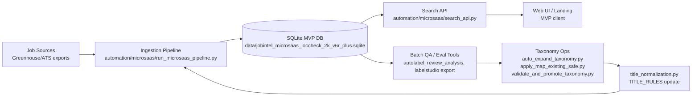
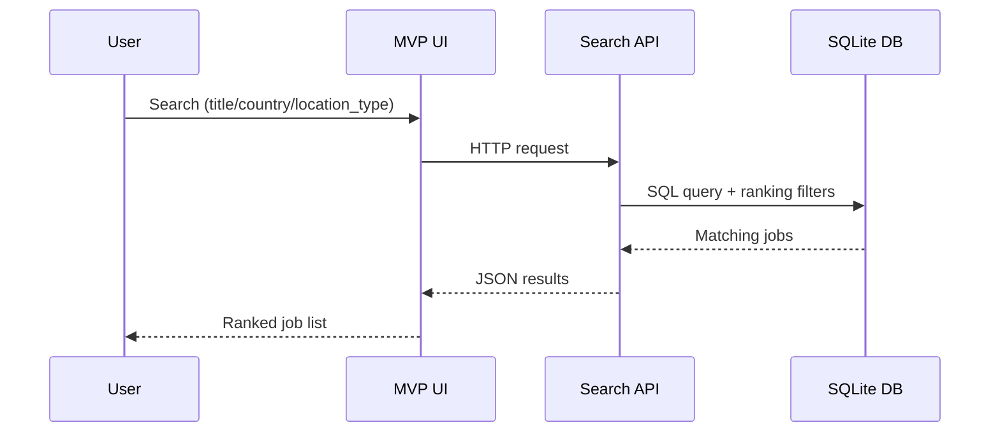
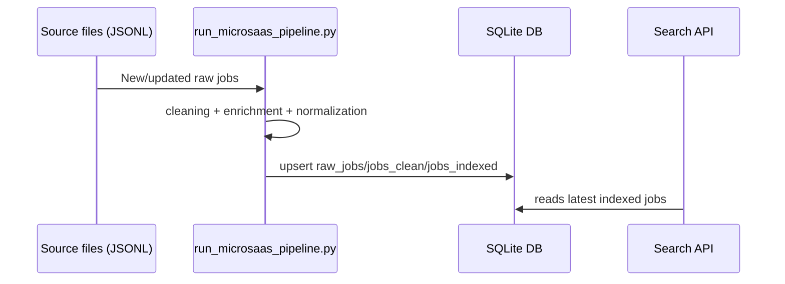
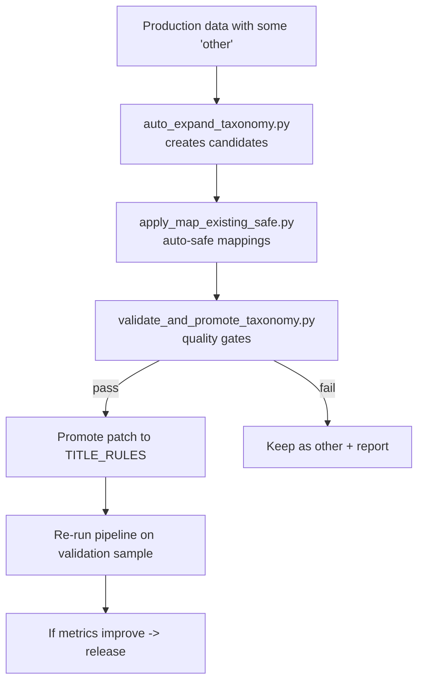
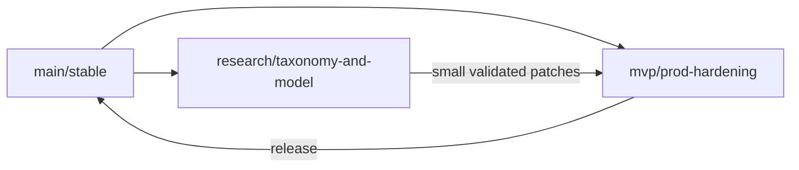

# Production Architecture (MVP)

## 1) System Overview


## 2) Runtime Query Path (User Search)


## 3) Data Build / Refresh Path


## 4) Taxonomy Improvement Loop (Controlled)


## 5) Deployment View (MVP)
```mermaid
flowchart LR
    subgraph Container_or_VM[Single host (Docker/VM)]
      API[Search API process]
      DB[(SQLite file volume)]
      CRON[Scheduled batch jobs\n(optional cron)]
    end

    API <--> DB
    CRON --> DB
```

## 6) Branching Model


## Notes
- MVP production now is intentionally simple: `Search API + SQLite + batch pipeline`.
- No external queue/cache is required for first customer tests.
- Taxonomy/model improvements stay isolated in research branch and are promoted only after checks.
